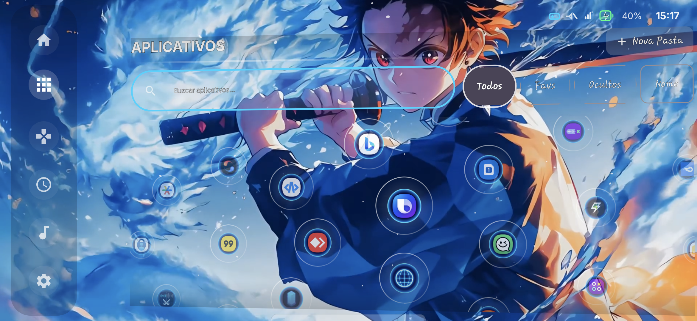

## Arcadia

Arcadia is a customizable Android game launcher designed to turn your device into a personalized gaming space.

The project aims to transform the Android home experience into a dedicated and highly customizable gaming environment, while keeping the interface practical, readable and adaptable to different users.

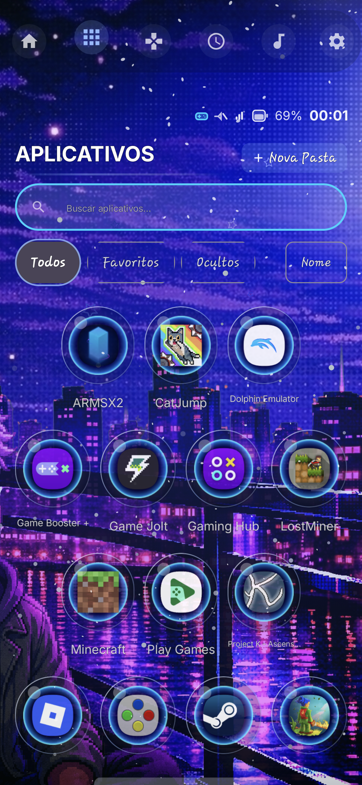

## ✨ Features

- 💽 Minimalist theme and no Animations
- 🎮 Game-focused application library
- 🎨 Multiple visual themes
- 🫧 Glass and Bubble visual styles
- ⭕ Circular, Cards and List layouts
- 🖼️ Custom wallpapers (Transparent, Image and Video)
- 🎛️ Controller-oriented navigation
- ♿ Accessibility-conscious UI
- ⚡ Performance-oriented rendering and animations

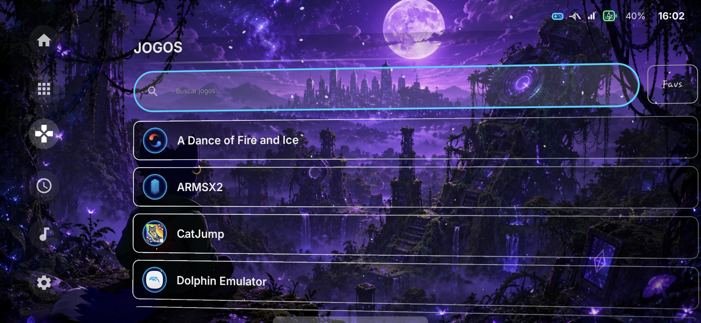

## 🚧 Status

Arcadia is currently under active development.

The project is evolving through continuous UI/UX improvements, performance optimization and architectural improvements.

This is also my first project. I wanted to do something different to please many Android users and also for my own gratification and approval.

## Some images of different settings

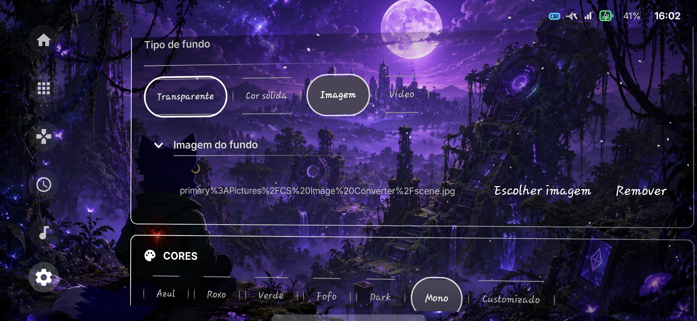

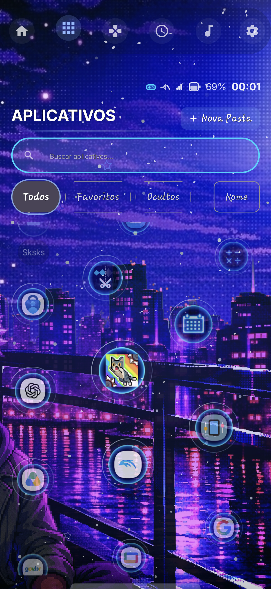
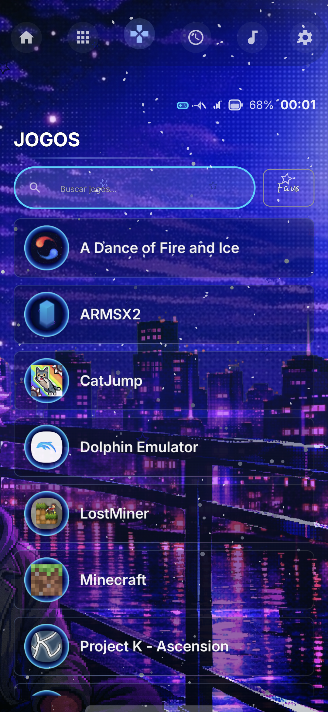
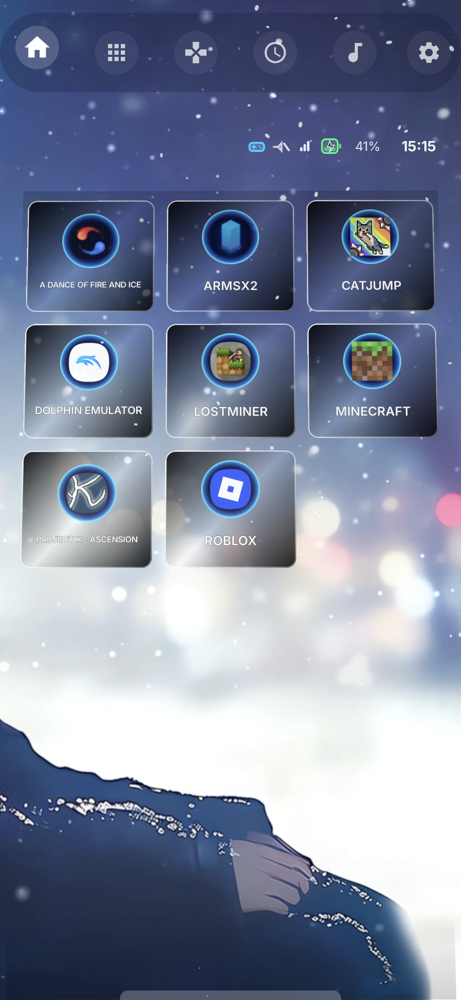

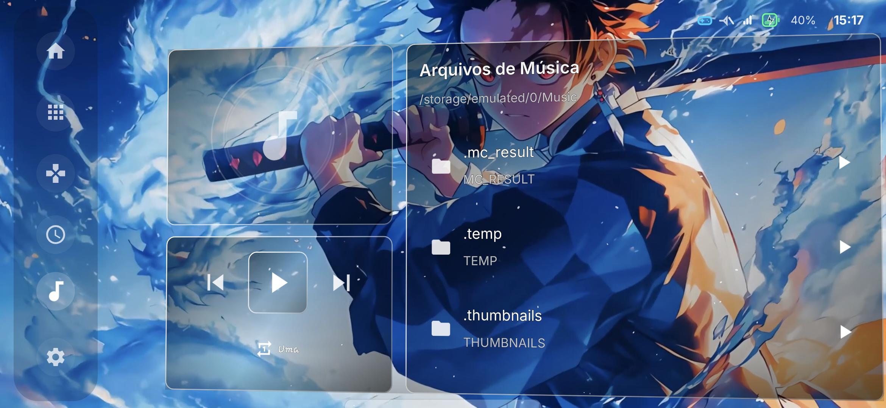
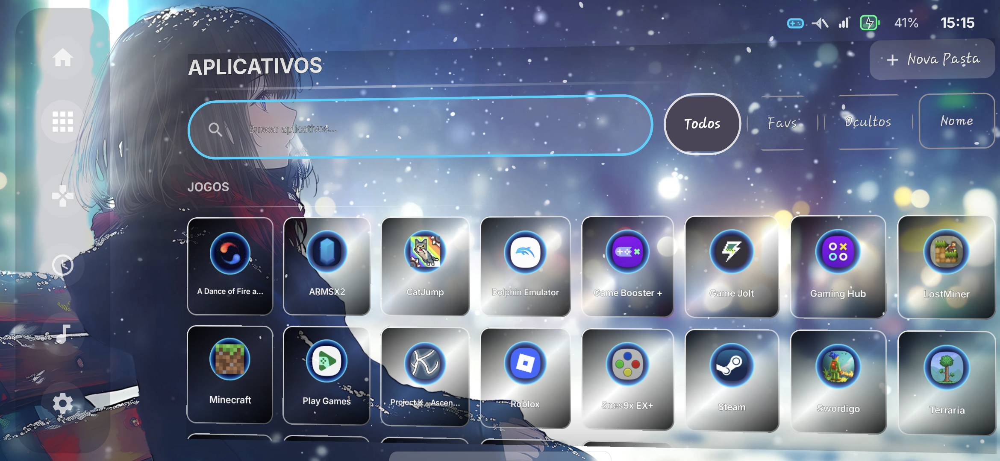

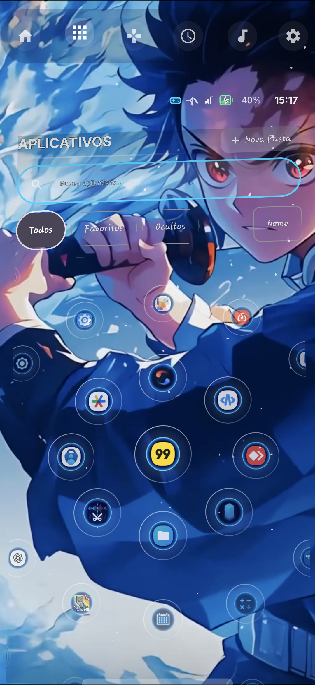

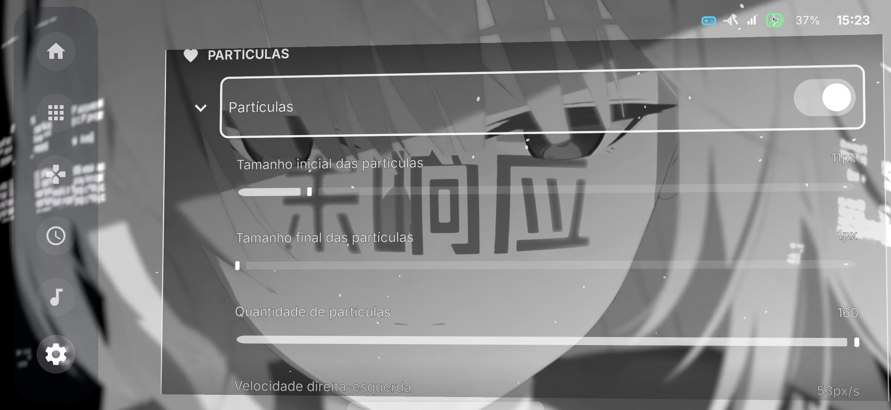

# About Me
My dream is to create my own game, but without much money to raise, with my mom's independence with gourmet sweets, I decided to make this app to receive both a commission and, mainly, to invest in creating my game.  

I’ve been working on the game for over a year (creation date of this README: August 10, 2026) completely on my own. So I want to start with small things and get useful feedback to improve.  

I’m counting on your help to support me and create more apps that you want for free... I won’t put ads or paid plans. I’m poor and Brazilian, just playing at being... Robin Hood.

# OBS
I'm a pretty busy guy with the situation mentioned earlier, so, patience...

